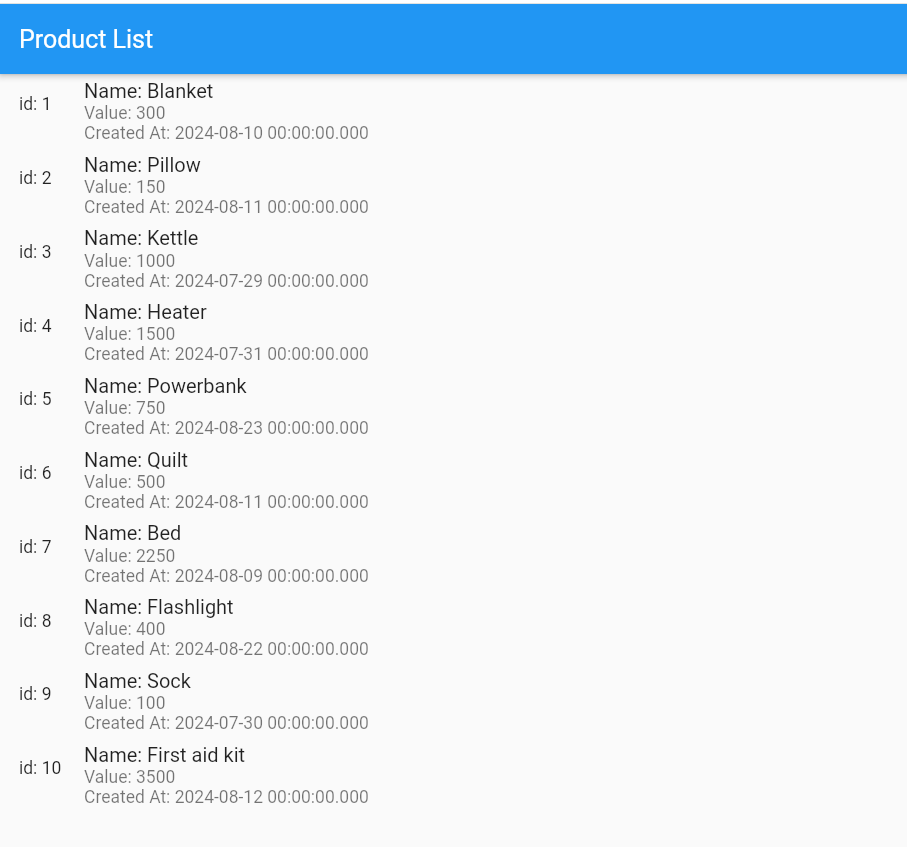
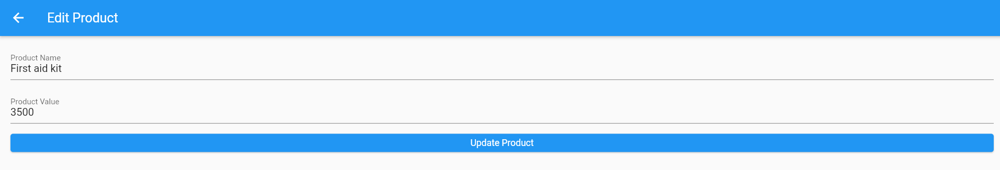

# Ürün Yönetim Sistemi

Bu proje, **depremzedelerin kullanabileceği bir ürün yönetim sistemi** olarak geliştirilmiştir. Sistem, yardım malzemelerinin yönetilmesi, stok takibi ve dağıtım süreçlerinin kolaylaştırılmasını amaçlar. Kullanıcılar, mevcut ürünleri listeleyebilir, yeni ürünler ekleyebilir ve var olan ürün bilgilerini güncelleyebilir.

## Kullanılan Teknolojiler

- **Flutter**: Mobil uygulamanın kullanıcı arayüzü ve işlevselliklerini geliştirmek için kullanıldı.
- **.NET Core**: Backend tarafında API oluşturmak ve ürün verilerini yönetmek için kullanıldı.
- **PostgreSQL**: Ürün verilerinin saklandığı veritabanı yönetim sistemi.
- **Entity Framework Core**: Veritabanı işlemlerini yönetmek için kullanılan ORM (Nesne-İlişkisel Eşleme) aracı.
#### Product List Page

#### Product Edit Page

